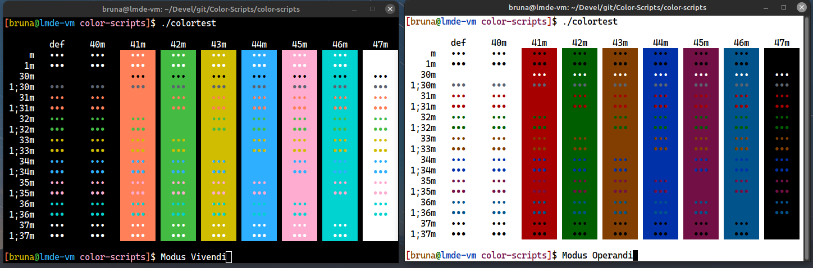

<h3 align="center">
	 
	Modus themes for GNOME-Terminal
</h3>

## Usage

1. `$ git clone https://github.com/modus-themes/gnome-terminal`.
2. `$ cd gnome-terminal`
3. Pick between Modus Operandi and Modus Vivendi
4. If you picked Modus Operandi follow the step below, if not, skip to step 7
5. `./install-operandi.sh "Terminal profile name`" (you can create a new profile by opening the GNOME-Terminal preferences window, then click on the + symbol)
6. If you picked Modus Vivendi follow the step below
7. `./install-vivendi.sh "Terminal profile name`" (you can create a new profile by opening the GNOME-Terminal preferences window, then click on the + symbol)

# Preview
<h4 align="center">
	Modus Vivendi & Modus Operandi
</h4>

# Credits
- [pacbru1260](https://github.com/pacbru1260)
